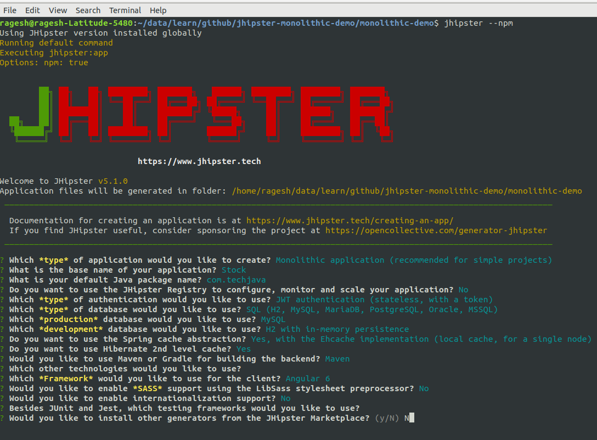
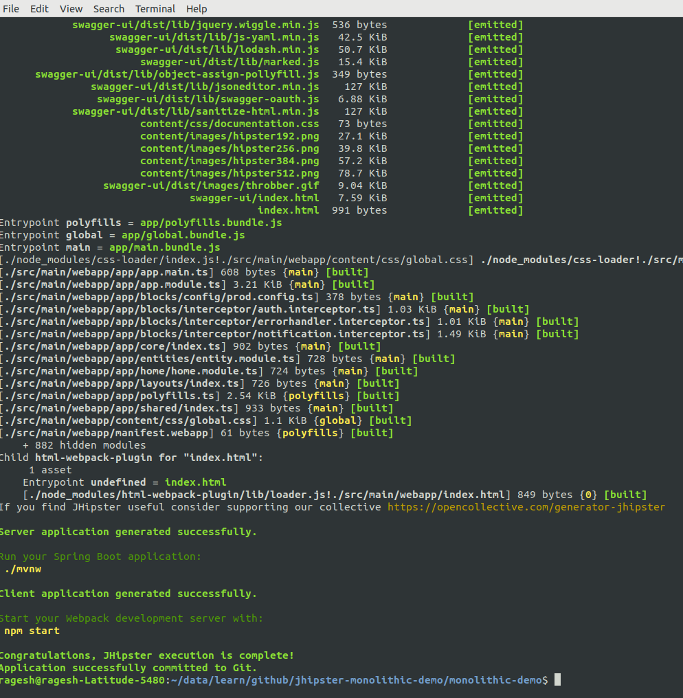

# jhipster-monolithic-stock-demo
This project explains how to use Jhipster with simple monolithic application

### JHipster 
JHipster is a development platform to generate, develop and deploy Spring Boot + Angular/React Web applications and Spring microservices.

In this project, I have generated a simple monolithic springboot application.

### Install JHipster

Install Java 8 from the Oracle website.
Install Node.js from the Node.js website (please use an LTS 64-bit version, non-LTS versions are not supported)

***Through Yarn***

Install Yarn from the Yarn website
If you want to use the JHipster Marketplace, install Yeoman: yarn global add yo
Install JHipster: yarn global add generator-jhipster

***Through npm***

Instead of installing Yarn from above, update NPM: npm install -g npm
Use npm install -g instead of yarn global add, for example:
To install Yeoman, type: npm install -g yo
To install JHipster, type: npm install -g generator-jhipster

### Sample JHipster Application Generator ###

